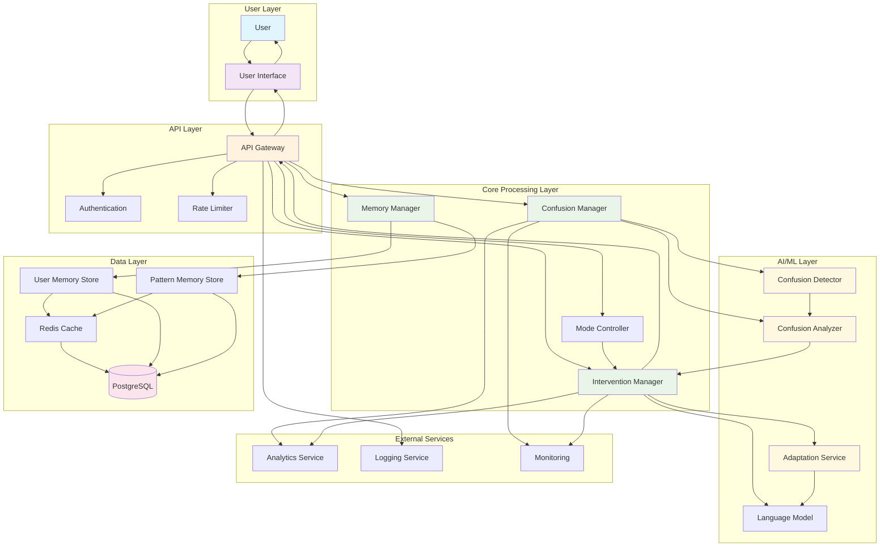
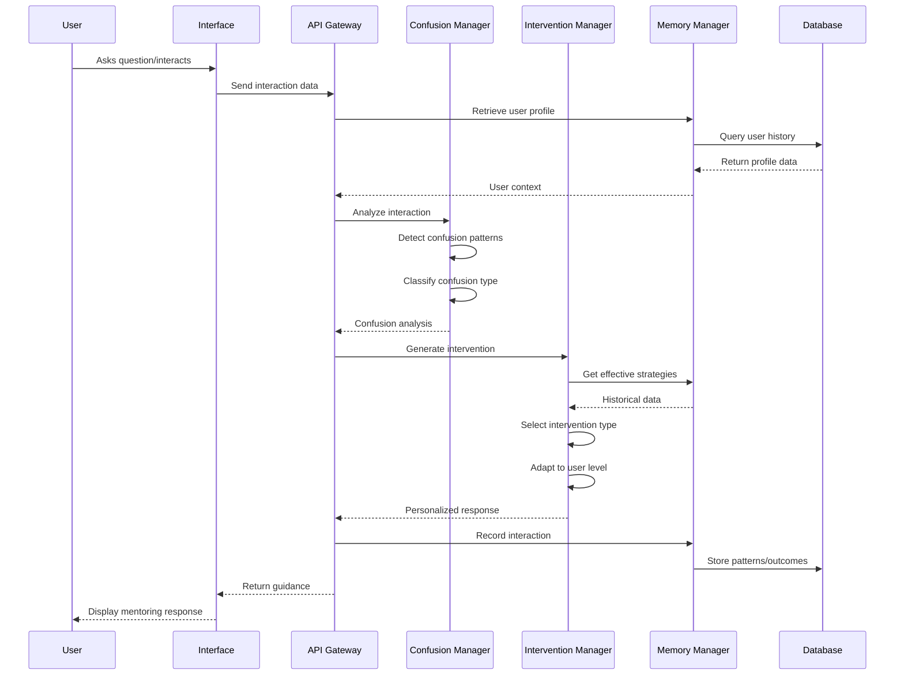
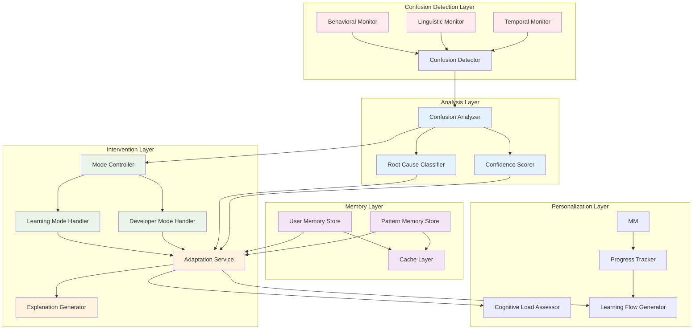

# Design Document: MENTOR.AI

## Overview

MENTOR.AI is a confusion-aware AI mentoring system that provides personalized guidance to students and early-stage developers. The system employs multimodal confusion detection, adaptive intervention strategies, and long-term memory to create a supportive learning environment that promotes deep understanding rather than surface-level problem solving.

The architecture follows a modular design with clear separation between confusion detection, intervention strategy selection, content delivery, and memory management. This enables scalable deployment while maintaining personalized experiences for each user.

## Architecture

The system follows a layered architecture with the following key components:

### High-Level Architecture Overview



### Data Flow Architecture



### Detailed Component Architecture



### Core Components

1. **Confusion Detection Layer**: Monitors user interactions and identifies confusion patterns
2. **Analysis Layer**: Classifies confusion types and determines root causes
3. **Intervention Layer**: Selects and executes appropriate mentoring strategies
4. **Memory Layer**: Maintains long-term user profiles and learning patterns
5. **Adaptation Layer**: Personalizes responses based on user characteristics and history

## Components and Interfaces

### Confusion Detector

The Confusion Detector employs multiple monitoring strategies based on research findings that multimodal approaches achieve highest accuracy:

**Behavioral Monitor**:
- Tracks interaction patterns: repeated questions, hesitation indicators, error frequencies
- Monitors session duration and engagement metrics
- Detects navigation patterns that suggest confusion

**Linguistic Monitor**:
- Analyzes question semantics using transformer-based models (BERT-style architecture)
- Identifies uncertainty markers in user language ("I think", "maybe", "not sure")
- Detects semantic incongruence in user responses

**Temporal Monitor**:
- Measures response times and pause patterns
- Identifies abnormal timing patterns that correlate with confusion
- Tracks learning velocity changes

**Interface**:
```typescript
interface ConfusionDetector {
  analyzeInteraction(interaction: UserInteraction): ConfusionSignal[]
  getConfusionScore(userId: string, sessionId: string): number
  registerConfusionPattern(pattern: ConfusionPattern): void
}

interface ConfusionSignal {
  type: 'behavioral' | 'linguistic' | 'temporal'
  confidence: number
  indicators: string[]
  timestamp: Date
}
```

### Confusion Analyzer

Processes confusion signals to determine root causes and classify confusion types:

**Root Cause Classifier**:
- Missing Prerequisite: Identifies knowledge gaps in foundational concepts
- Wrong Mental Model: Detects misconceptions in user understanding
- Logic vs Syntax: Distinguishes between conceptual and implementation confusion
- Cognitive Overload: Recognizes when information complexity exceeds processing capacity

**Confidence Scorer**:
- Maintains confidence scores for each classification
- Uses ensemble methods to combine multiple signal sources
- Provides uncertainty estimates for intervention decisions

**Interface**:
```typescript
interface ConfusionAnalyzer {
  classifyConfusion(signals: ConfusionSignal[]): ConfusionClassification
  assessConfidence(classification: ConfusionClassification): number
  updateClassificationModel(feedback: ClassificationFeedback): void
}

interface ConfusionClassification {
  rootCause: 'missing_prerequisite' | 'wrong_mental_model' | 'logic_vs_syntax' | 'cognitive_overload'
  confidence: number
  supportingEvidence: string[]
  recommendedIntervention: InterventionType
}
```

### Intervention Manager

Orchestrates mentoring responses based on confusion analysis and user context:

**Mode Handlers**:
- Learning Mode: Focuses on concept building, analogies, and guided discovery
- Developer Mode: Emphasizes debugging strategies, workflow optimization, and practical solutions

**Adaptation Service**:
- Adjusts explanation complexity based on user level
- Manages cognitive load through progressive disclosure
- Personalizes intervention strategies based on historical effectiveness

**Interface**:
```typescript
interface InterventionManager {
  selectIntervention(classification: ConfusionClassification, userContext: UserContext): Intervention
  executeIntervention(intervention: Intervention): InterventionResult
  adaptToFeedback(result: InterventionResult): void
}

interface Intervention {
  type: 'questioning' | 'analogy' | 'example' | 'simplification' | 'prerequisite_review'
  content: string
  cognitiveLoad: 'low' | 'medium' | 'high'
  expectedOutcome: string
}
```

### Memory Manager

Maintains persistent user profiles and learning patterns:

**User Memory Store**:
- Stores individual learning history, confusion patterns, and successful interventions
- Tracks knowledge state and skill progression
- Maintains preference profiles for personalization

**Pattern Memory Store**:
- Aggregates anonymized patterns across users
- Identifies common confusion sequences and effective intervention chains
- Supports continuous improvement of the mentoring system

**Interface**:
```typescript
interface MemoryManager {
  getUserProfile(userId: string): UserProfile
  updateUserProfile(userId: string, update: ProfileUpdate): void
  getEffectiveInterventions(userId: string, confusionType: string): Intervention[]
  recordInterventionOutcome(userId: string, intervention: Intervention, outcome: InterventionOutcome): void
}

interface UserProfile {
  knowledgeState: Map<string, number>
  confusionPatterns: ConfusionPattern[]
  preferredInterventions: InterventionType[]
  cognitiveLoadTolerance: number
  learningVelocity: number
}
```

## Data Models

### Core Data Structures

**User Interaction Model**:
```typescript
interface UserInteraction {
  id: string
  userId: string
  sessionId: string
  timestamp: Date
  type: 'question' | 'response' | 'navigation' | 'error'
  content: string
  context: InteractionContext
  metadata: {
    responseTime: number
    editCount: number
    hesitationMarkers: string[]
  }
}
```

**Learning Session Model**:
```typescript
interface LearningSession {
  id: string
  userId: string
  startTime: Date
  endTime?: Date
  mode: 'learning' | 'developer'
  topic: string
  interactions: UserInteraction[]
  confusionEvents: ConfusionEvent[]
  interventions: InterventionRecord[]
  outcomes: SessionOutcome
}
```

**Confusion Pattern Model**:
```typescript
interface ConfusionPattern {
  id: string
  userId: string
  patternType: string
  frequency: number
  contexts: string[]
  triggers: string[]
  effectiveInterventions: string[]
  lastOccurrence: Date
}
```

**Learning Flow Model**:
```typescript
interface LearningFlow {
  id: string
  userId: string
  topic: string
  prerequisites: string[]
  steps: LearningStep[]
  adaptations: FlowAdaptation[]
  progress: FlowProgress
}

interface LearningStep {
  id: string
  type: 'concept' | 'example' | 'practice' | 'assessment'
  content: string
  cognitiveLoad: number
  prerequisites: string[]
  learningObjectives: string[]
}
```

## Correctness Properties

*A property is a characteristic or behavior that should hold true across all valid executions of a system—essentially, a formal statement about what the system should do. Properties serve as the bridge between human-readable specifications and machine-verifiable correctness guarantees.*

Based on the prework analysis of acceptance criteria, the following properties validate the system's correctness:

### Confusion Detection Properties

**Property 1: Repeated Question Detection**
*For any* user session containing similar questions asked multiple times, the Confusion_Detector should identify this as a confusion pattern with appropriate confidence scoring.
**Validates: Requirements 1.1**

**Property 2: Hesitation Pattern Recognition**
*For any* user interaction exhibiting hesitation indicators (long pauses, incomplete inputs), the Confusion_Detector should flag these as confusion signals.
**Validates: Requirements 1.2**

**Property 3: Error Pattern Classification**
*For any* sequence of repeated errors of the same type, the Confusion_Detector should classify this as a confusion signal.
**Validates: Requirements 1.3**

**Property 4: Root Cause Classification Completeness**
*For any* detected confusion, the Mentor_System should classify the root cause as exactly one of: missing prerequisite, wrong mental model, logic vs syntax error, or cognitive overload.
**Validates: Requirements 1.4**

**Property 5: Confidence Score Consistency**
*For any* confusion classification, the system should provide a valid confidence score between 0 and 1.
**Validates: Requirements 1.5**

### Mentoring Approach Properties

**Property 6: Questioning Over Direct Answers**
*For any* guidance request, the Mentor_System should respond with questions or hints rather than direct solutions.
**Validates: Requirements 2.1, 2.2**

**Property 7: Experience-Appropriate Explanations**
*For any* concept explanation, the content should match the user's demonstrated experience level and include appropriate analogies.
**Validates: Requirements 2.3**

**Property 8: Transparent Reasoning**
*For any* explanation provided, the response should include transparent reasoning for the chosen approach.
**Validates: Requirements 2.4, 7.3**

**Property 9: Progress Recognition and Advancement**
*For any* demonstration of user understanding, the system should acknowledge progress and suggest appropriate next steps.
**Validates: Requirements 2.5**

### Mode-Specific Behavior Properties

**Property 10: Learning Mode Characteristics**
*For any* interaction in Learning_Mode, responses should focus on concept understanding, provide educational examples, and include guided questions.
**Validates: Requirements 3.1**

**Property 11: Developer Mode Characteristics**
*For any* interaction in Developer_Mode, responses should focus on debugging help, logic clarification, and workflow suggestions.
**Validates: Requirements 3.2**

**Property 12: Mode Transition Adaptation**
*For any* mode switch, the system should adapt response style and intervention strategies to match the new mode.
**Validates: Requirements 3.3**

**Property 13: Automatic Mode Detection**
*For any* user query with clear contextual indicators, the system should automatically select the appropriate mode.
**Validates: Requirements 3.4**

**Property 14: Mode Uncertainty Handling**
*For any* ambiguous context where mode detection confidence is low, the system should request user clarification.
**Validates: Requirements 3.5**

### Adaptive Learning Properties

**Property 15: Complexity Adaptation**
*For any* user with demonstrated knowledge level, explanations should adapt complexity appropriately, with advanced users receiving sophisticated content and beginners receiving simplified content.
**Validates: Requirements 4.1, 4.2, 4.3**

**Property 16: Progressive Complexity Growth**
*For any* user showing improved understanding over time, explanation complexity should gradually increase.
**Validates: Requirements 4.4**

**Property 17: Cognitive Overload Response**
*For any* detected cognitive overload, the system should simplify explanations and break information into smaller chunks.
**Validates: Requirements 4.5**

### Memory and Personalization Properties

**Property 18: Comprehensive Data Storage**
*For any* user interaction, the Mentor_Memory should store interaction patterns, confusion types, and successful intervention strategies.
**Validates: Requirements 5.1**

**Property 19: Historical Data Retrieval**
*For any* returning user, the system should recall and utilize previous confusion patterns and learning progress.
**Validates: Requirements 5.2**

**Property 20: Intervention Effectiveness Tracking**
*For any* user, the system should track and maintain records of which intervention strategies were most effective.
**Validates: Requirements 5.3**

**Property 21: Historical Personalization**
*For any* guidance generation, the system should reference and incorporate historical user data for personalization.
**Validates: Requirements 5.4**

**Property 22: Pattern-Based Recommendations**
*For any* recurring confusion pattern, the system should identify it and suggest targeted learning activities.
**Validates: Requirements 5.5**

### Learning Flow Properties

**Property 23: Gap-Driven Flow Generation**
*For any* identified confusion pattern, the system should generate personalized learning flows that address the specific knowledge gaps.
**Validates: Requirements 6.1**

**Property 24: Prerequisite-Ordered Learning**
*For any* learning sequence, it should build from the user's current understanding level and ensure prerequisite concepts are addressed before advanced topics.
**Validates: Requirements 6.2, 6.5**

**Property 25: Progress-Based Flow Adaptation**
*For any* completed learning activity, the system should update subsequent learning flow steps based on demonstrated progress.
**Validates: Requirements 6.3**

**Property 26: Priority-Based Activity Ordering**
*For any* set of learning activities, they should be prioritized based on frequency and severity of associated confusion patterns.
**Validates: Requirements 6.4**

### System Reliability Properties

**Property 27: Graceful Degradation Under Load**
*For any* high system load condition, non-essential features should degrade while core mentoring functionality remains operational.
**Validates: Requirements 8.3**

**Property 28: User Data Isolation**
*For any* concurrent user operations, there should be no data corruption or cross-user information leakage.
**Validates: Requirements 8.5**

### User Interface Properties

**Property 29: Progressive Information Disclosure**
*For any* guidance display, information should be presented in digestible chunks using progressive disclosure techniques.
**Validates: Requirements 9.2**

**Property 30: Guidance Type Differentiation**
*For any* guidance response, different types (questions, hints, explanations) should have clear visual indicators.
**Validates: Requirements 9.3**

**Property 31: Adaptive Interface Simplification**
*For any* detected cognitive overload, the interface should simplify and reduce information density.
**Validates: Requirements 9.4**

**Property 32: Consistent Interaction Patterns**
*For any* user interface element, interaction patterns should remain consistent across the system to minimize learning overhead.
**Validates: Requirements 9.5**

<function_calls>
<invoke name="prework">
<parameter name="featureName">mentor-ai

## Error Handling

The system implements comprehensive error handling across all components to ensure graceful degradation and user experience continuity:

### Confusion Detection Errors
- **Signal Processing Failures**: When behavioral or linguistic analysis fails, the system falls back to simpler heuristics and logs the failure for model improvement
- **Classification Uncertainty**: When confidence scores fall below threshold (< 0.3), the system requests additional user input rather than making potentially incorrect interventions
- **Model Unavailability**: If ML models become unavailable, the system switches to rule-based fallback detection methods

### Intervention Delivery Errors
- **Content Generation Failures**: If personalized content generation fails, the system provides generic but appropriate guidance while logging the failure
- **Mode Detection Errors**: When automatic mode detection fails, the system explicitly asks users to specify their current goal
- **Adaptation Failures**: If complexity adaptation fails, the system defaults to medium complexity with clear language

### Memory System Errors
- **Data Retrieval Failures**: When user history cannot be retrieved, the system operates in stateless mode while attempting background recovery
- **Storage Failures**: Critical user progress is cached locally and synchronized when storage becomes available
- **Corruption Detection**: The system validates data integrity and rebuilds corrupted profiles from interaction logs

### System-Level Error Handling
- **Performance Degradation**: Under high load, the system prioritizes core mentoring functions over advanced personalization features
- **Service Unavailability**: Critical path failures trigger graceful degradation with clear user communication about reduced functionality
- **Data Privacy Violations**: Any detected privacy breach immediately triggers data isolation and user notification protocols

## Testing Strategy

The testing approach combines comprehensive unit testing with property-based testing to ensure both specific behavior validation and general correctness across all possible inputs.

### Unit Testing Approach

**Component-Level Testing**:
- Test specific confusion detection algorithms with known input patterns
- Validate intervention selection logic with predefined user profiles
- Verify memory operations with controlled data sets
- Test error handling paths with simulated failure conditions

**Integration Testing**:
- Test complete user interaction flows from confusion detection through intervention delivery
- Validate cross-component communication and data consistency
- Test mode switching and adaptation behaviors
- Verify privacy and security controls across component boundaries

**Example Unit Tests**:
- Test that repeated "how do I..." questions within 5 minutes trigger confusion detection
- Verify that beginner users receive explanations with Flesch-Kincaid grade level ≤ 8
- Test that cognitive overload detection triggers interface simplification
- Validate that user data deletion removes all associated records

### Property-Based Testing Configuration

**Testing Framework**: Use Hypothesis (Python) or fast-check (TypeScript) for property-based testing
**Test Configuration**: Minimum 100 iterations per property test to ensure comprehensive input coverage
**Test Tagging**: Each property test must reference its design document property using the format:
`# Feature: mentor-ai, Property {number}: {property_text}`

**Property Test Examples**:

```python
# Feature: mentor-ai, Property 1: Repeated Question Detection
@given(sessions_with_repeated_questions())
def test_repeated_question_detection(session):
    confusion_signals = confusion_detector.analyze_session(session)
    assert any(signal.type == 'repeated_questions' for signal in confusion_signals)
    assert all(signal.confidence > 0 for signal in confusion_signals)

# Feature: mentor-ai, Property 15: Complexity Adaptation  
@given(users_with_knowledge_levels(), explanations())
def test_complexity_adaptation(user, base_explanation):
    adapted = mentor_system.adapt_explanation(base_explanation, user)
    if user.knowledge_level == 'beginner':
        assert adapted.complexity_score < base_explanation.complexity_score
    elif user.knowledge_level == 'advanced':
        assert adapted.complexity_score >= base_explanation.complexity_score
```

**Generator Strategies**:
- Generate diverse user interaction patterns including edge cases (empty sessions, extremely long sessions)
- Create varied confusion patterns (single vs multiple types, different confidence levels)
- Generate user profiles across experience spectrums (complete beginner to expert)
- Create learning content with different complexity levels and cognitive loads

### Performance and Load Testing

**Response Time Validation**:
- Ensure 95th percentile response times remain under 2 seconds under normal load
- Test graceful degradation behavior under 10x normal load
- Validate memory usage remains stable during extended sessions

**Scalability Testing**:
- Test concurrent user handling up to target capacity
- Validate data isolation under concurrent access
- Test memory system performance with large user bases

**Privacy and Security Testing**:
- Validate data encryption and access controls
- Test user data deletion completeness
- Verify no cross-user data leakage under concurrent operations

### Continuous Testing Strategy

**Automated Testing Pipeline**:
- Run all unit tests on every code change
- Execute property-based tests nightly with extended iteration counts (1000+ per property)
- Perform integration testing on staging environment before production deployment
- Run performance regression tests weekly

**Monitoring and Feedback**:
- Monitor property test failures in production-like environments
- Track intervention effectiveness rates to validate mentoring approach properties
- Collect user feedback to validate user experience properties
- Use A/B testing to validate adaptation and personalization properties

This comprehensive testing strategy ensures that MENTOR.AI maintains high reliability, correctness, and user experience quality while scaling to support diverse learning needs.